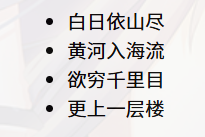
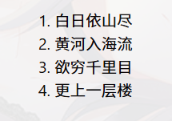
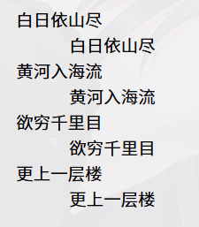
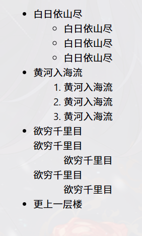

### HTML标签


| 标签                | 描述                                                                                                               |
| ------------------- | ------------------------------------------------------------------------------------------------------------------ |
| `<title></title>`   | 定义**网页的标题**                                                                                                 |
| `<link/>`           | 定义文档和外部资源之间的关系（如引用外部CSS文件等）<br />一个页面允许使用**多个`<link/>`**标签引用**多个外部文件** |
| `<meta/>`           | 定义HTML5文档中的**元数据**，可重复出现在页面头部                                                                  |
| `<style></style>`   | 定义页面中使用的内联CSS样式                                                                                        |
| `<script></script>` | 定义页面引用JavaScript代码或文件                                                                                   |

### 部分标签的属性

#### 标签种类

标签有单标签，双标签，注释标签等，单标签不常用，双标签最常用，注释标签不会显示在页面上，仅作为注释使用。

字体、颜色、子号、位置等，使用key-value形式来进行编写

<标签名 属性一="某属性",......>

HTML提供了多个不同等级的标题文本标签，从< h1 >到< h6 >的重要性依次递减，并可以用align属性来规定文字对齐方式

< p >标签为段落标签，可以根据浏览器窗口的大小自动换行

< br >是一个换行标签

< hr >则是一个水平线标签

#### 列表标签

无需列表ul

```
<ul>
	<li>白日依山尽</li>
	<li>黄河入海流</li>
	<li>欲穷千里目</li>
	<li>更上一层楼</li>
</ul>
```



有序列表ol

```
<ol>
	<li>白日依山尽</li>
	<li>黄河入海流</li>
	<li>欲穷千里目</li>
	<li>更上一层楼</li>
</ol>
```



定义列表dl

```
<dl>
	<dt>白日依山尽</dt>
	<dd>白日依山尽</dd>
	<dt>黄河入海流</dt>
	<dd>黄河入海流</dd>
	<dt>欲穷千里目</dt>
	<dd>欲穷千里目</dd>
	<dt>更上一层楼</dt>
	<dd>更上一层楼</dd>
</dl>
```



#### 列表标签的嵌套

```
<ul>
	<li>
		白日依山尽
		<ul>
			<li>白日依山尽</li>
			<li>白日依山尽</li>
			<li>白日依山尽</li>
		</ul>
	</li>
	<li>
		黄河入海流
		<ol>
			<li>黄河入海流</li>
			<li>黄河入海流</li>
			<li>黄河入海流</li>
		</ol>
	</li>
	<li>
		欲穷千里目
		<dl>
			<dt>欲穷千里目</dt>
			<dd>欲穷千里目</dd>
			<dt>欲穷千里目</dt>
			<dd>欲穷千里目</dd>
		</dl>
	</li>
	<li>更上一层楼</li>
</ul>
```




HTML5不支持无序列表的type属性，一般用CSS样式替代
