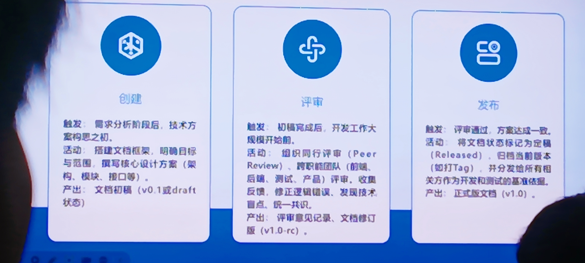
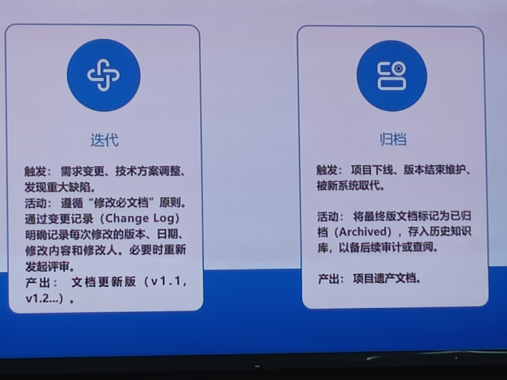

20250911

MarkDown GitBoot Notion 飞书文档等，是常用的技术文档

### 什么是设计文档？它有什么用？

设计文档是用文字、图表、符号描述设计方案的技术文档，它是团队协作、项目管理与技术传承的重要工具，记录着从需求到实现的每一步关键决策与设计思路。

作为团队沟通的桥梁，固化设计思想，降低项目风险，作为交付成果，

需求规格说明书SRS，概要设计文档（模块图）， 详细设计文档（类图、流程图）， 接口文档（API说明）， 测试文档（Test Plan）等，都属于设计文档

### 设计文档包括什么？

#### 封面

封面包括文档标题、作者、版本号等信息，让读者快速了解文档的核心内容与来源，便于后续查阅与管理

#### 目录

文档的整体框架

#### 引言

文档的目的、范围与背景

#### 正文与附录

设计方案、模块说明与图表，附录收录术语表、参考文档等补充信息

### 语言与格式

#### 语言规范

简洁、明确、无歧义，尽量使用简洁的语言，避免模糊词汇与复杂句式

#### 格式规范

统一编号、符号，图表清晰

#### 标准与模板

遵循国际标准IEEE 830，国家标准GB/T 8567及企业内部模板

#### 交叉引用

比如“见 图-3”等都是

设计文档并非一次性产物，而是一个贯穿项目始终、不断演进的“活体”

| 生命周期阶段 | 项目阶段对应的活动           | 文档状态标志               |
| ------------ | ---------------------------- | -------------------------- |
| 创建 Create  | 需求分析后，开发开始前       | v0.1/Craft                 |
| 评审 Review  | 技术方案评审会               | v1.0-rc(Release Candidate) |
| 发布 Release | 开发迭代启动                 | v1.0/Released              |
| 迭代 lterate | 开发过程中需求变更或方案调整 | v1.1/v1.2                  |
| 归档 Archive | 项目下线或版本结束维护       | Archived                   |

